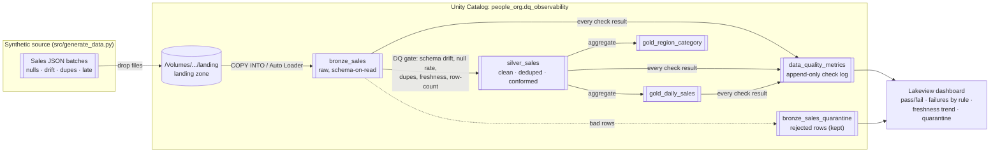

# Real-Time Data Quality Observability Framework

A portfolio project that simulates a **real-time sales ingestion stream** on
**Databricks Free Edition** and layers a full **data-quality observability** framework
on top of it: a Bronze → Silver → Gold medallion pipeline with automated DQ gates
between every layer, a quarantine-not-fail strategy, an append-only metrics log, and a
native **Lakeview** dashboard.

Everything runs on **serverless compute only** — no dedicated clusters, no paid
compute, no workspace-admin rights beyond what a Free Edition account already has.

> **Domain:** e-commerce **sales** orders (synthetic). The generator streams JSON order
> events and deliberately injects nulls, schema drift, duplicates, and late-arriving
> records so the observability layer has real problems to catch.

---

## Architecture



**Two execution paths, one set of tables:**

| Path | Runs where | Ingestion | Use it for |
|------|-----------|-----------|------------|
| `src/run_pipeline.py` | Your laptop → serverless **SQL warehouse** (Statement Execution API) | `COPY INTO` | Local dev, CI, "run it end-to-end without a cluster" |
| `notebooks/*.py` | Databricks **serverless compute** | Auto Loader (`cloudFiles`) + Structured Streaming | The native notebook/job experience |

Both write to the **same** `people_org.dq_observability.*` Delta tables.

---

## Data-quality checks

Run between layers; results logged to `data_quality_metrics` (never silently dropped).

| Rule | What it catches | Threshold (default) | On breach |
|------|-----------------|---------------------|-----------|
| `schema_drift` | extra/missing/renamed columns, rescued data | any drift | FAIL + rescued rows quarantined |
| `null_rate` | nulls in required fields | > 5% per column | FAIL (WARN if any nulls under threshold) |
| `duplicate` | repeated `order_id` | > 0 | FAIL; dedup keeps latest in Silver |
| `freshness_sla` | staleness of newest record | > 24h | FAIL |
| `late_arriving` | events backdated before ingest | > 24h backdate | WARN (expected in streaming) |
| `row_count_anomaly` | batch size vs. trailing average | ±50% band | WARN (PASS on first/baseline run) |

Thresholds live in [`src/dq_rules.py`](src/dq_rules.py) and are unit-tested.

---

## Design decisions

**Quarantine over hard-fail.** A streaming quality framework that aborts on the first
bad record is useless — one malformed row would halt the whole feed. Instead, bad rows
are routed to `*_quarantine` tables with a `quarantine_reason`, good data keeps flowing
to Silver, and the breach shows up as a FAIL on the dashboard. You get *visibility and
containment* instead of *outage*.

**Why these specific checks.** They map to the four ways real ingestion breaks:
*structure* (schema drift), *completeness* (null rate), *correctness/idempotency*
(duplicates), and *timeliness* (freshness + late arrivals). `row_count_anomaly` is a
cheap canary for upstream outages (a feed silently going to zero).

**SQL warehouse for local runs.** Local Spark on Windows needs Hadoop/winutils, and
Databricks Connect is version-fragile on serverless. Running SQL on the serverless SQL
warehouse via the Statement Execution API sidesteps both and still exercises real Delta,
`COPY INTO`, `MERGE`, and Unity Catalog. It also means **no `thrift`/`databricks-sql-connector`**
dependency (which some corporate proxies block).

**Custom rules, not Great Expectations.** GE was the first choice, but its 1.x API is
heavy to run against serverless. Pure-Python rule functions are dependency-free,
unit-testable offline, and trivial to reason about — the right trade-off for a
demonstrable portfolio piece. (GE can be layered back in later; see
`requirements.txt`.)

---

## Setup

**Prerequisites:** Python 3.10+, a Databricks Free Edition workspace, a running
**serverless SQL warehouse**, and a Personal Access Token.

```bash
# 1. clone + enter
git clone https://github.com/ash-codess/Data-Quality-Observability-Framework.git
cd Data-Quality-Observability-Framework

# 2. virtual env
python -m venv .venv
# Windows:  .venv\Scripts\activate      macOS/Linux: source .venv/bin/activate

# 3. install
pip install -r requirements.txt

# 4. credentials
cp .env.example .env      # then edit .env with your host, token, and warehouse http path
```

`.env` (git-ignored — never commit it):

```
DATABRICKS_HOST=dbc-xxxxxxxx-xxxx.cloud.databricks.com
DATABRICKS_TOKEN=dapiXXXXXXXXXXXXXXXXXXXXXXXXXXXXXX
DATABRICKS_HTTP_PATH=/sql/1.0/warehouses/XXXXXXXXXXXXXXXX
DQ_CATALOG=people_org
DQ_SCHEMA=dq_observability
DQ_VOLUME=landing
```

---

## How to run locally

```bash
# 1. generate a synthetic sales stream (JSON batches into data/synthetic/)
python -m src.generate_data --batches 5 --rows-per-batch 200 --anomaly-rate 0.2

# 2. run the whole pipeline against your workspace
#    (creates catalog/schema/volume/tables, uploads files, ingests, checks, verifies)
python -m src.run_pipeline

# handy flags
python -m src.run_pipeline --setup-only     # just create UC objects
python -m src.run_pipeline --skip-upload     # reuse files already in the volume
python -m src.run_pipeline --verify-only     # print row counts only

# 3. run the tests (pure Python, no workspace needed)
pytest -q
```

Simulate a live stream by re-running the generator then the pipeline on a loop — each
run stamps a new `run_id`, so the dashboard time-series tiles fill in over time.
`COPY INTO` only ingests files it hasn't seen, so reruns are idempotent.

### Running on Databricks (notebook path)
Import `notebooks/` into your workspace (**Workspace → Import**), attach to
**Serverless**, set the `catalog`/`schema` widgets, and run in order:
`00_setup` → `01_bronze_autoloader` → `02_silver_dq` → `03_gold`. You can also chain
them as a serverless **Job** with the `run_id` passed between tasks.

---

## Dashboard

SQL for every tile is in [`dashboards/queries.sql`](dashboards/queries.sql); step-by-step
import instructions are in [`dashboards/INSTRUCTIONS.md`](dashboards/INSTRUCTIONS.md).
Tiles: pass/fail rate over time, failures by rule type, freshness lag trend, quarantined
rows by reason, KPI counters, latest-run scorecard, and gold revenue by region.

<!-- Replace these with real screenshots once you've published the Lakeview dashboard -->

*Overview: pass/fail trend, failures by rule, freshness SLA, quarantine breakdown.*


*Latest-run scorecard and gold business KPIs.*

---

## Repository layout

```
realtime-dq-observability/
├── notebooks/                  # Databricks serverless notebooks (Auto Loader path)
│   ├── 00_setup.py
│   ├── 01_bronze_autoloader.py
│   ├── 02_silver_dq.py
│   └── 03_gold.py
├── src/
│   ├── config.py               # .env loader + Statement Execution API helpers
│   ├── generate_data.py        # synthetic sales stream generator
│   ├── dq_rules.py             # pure-Python DQ rule evaluators (unit-tested)
│   ├── sql_pipeline.py         # SQL builders: DDL, COPY INTO, probes, silver, gold
│   └── run_pipeline.py         # local end-to-end orchestrator
├── dashboards/
│   ├── queries.sql
│   └── INSTRUCTIONS.md
├── data/synthetic/             # local landing zone (git-ignored)
├── tests/                      # pytest suite for rules + generator
├── .env.example
├── requirements.txt
└── README.md
```

---

## Notes & limitations
- **Free Edition / serverless only.** No dedicated clusters are used or required.
- Lakeview dashboards aren't fully API-scriptable yet, so the dashboard is built once in
  the UI from the provided SQL (~10 min).
- Rotate your PAT if it's ever been shared; `.env` is git-ignored by design.
