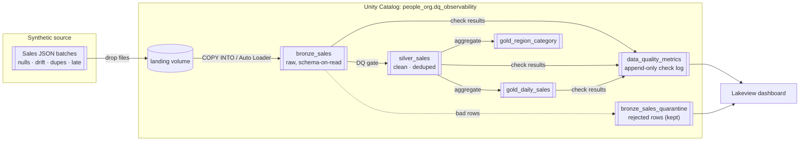

```
     ___   ___    ___  _                             _     _ _ _ _
    |   \ / _ \  / _ \| |__ ___ ___ _ ___ ____ _ | |__(_) (_) |_ _  _
    | |) | (_) || (_) | '_ (_-</ -_) '_\ V / _` || '_ \ | | |  _| || |
    |___/ \__\_\ \___/|_.__/__/\___|_|  \_/\__,_||_.__/_|_|_|\__|\_, |
                                                                 |__/
    real-time data-quality observability · medallion · serverless
```

# Real-Time Data Quality Observability

A Bronze → Silver → Gold medallion pipeline with **automated data-quality gates
between every layer**, a *quarantine-not-fail* strategy, an append-only metrics
log, and a native **Lakeview** dashboard — running entirely on **Databricks
serverless** compute.

A synthetic generator streams JSON sales orders and deliberately injects nulls,
schema drift, duplicates, and late-arriving records, so the observability layer
has real problems to catch and surface.

---

## Architecture



**Two execution paths, one set of tables:**

| Path | Runs where | Ingestion |
|------|-----------|-----------|
| `src/run_pipeline.py` | Laptop → serverless **SQL warehouse** (Statement Execution API) | `COPY INTO` |
| `notebooks/*.py` | Databricks **serverless compute** | Auto Loader + Structured Streaming |

Both write to the same `people_org.dq_observability.*` Delta tables.

---

## Data-quality checks

Run between layers; every result is logged to `data_quality_metrics` — never
silently dropped. Thresholds live in [`src/dq_rules.py`](src/dq_rules.py) and are
unit-tested.

| Rule | Catches | Default threshold | On breach |
|------|---------|-------------------|-----------|
| `schema_drift` | extra/missing/renamed columns | any drift | FAIL + quarantine |
| `null_rate` | nulls in required fields | > 5% per column | FAIL |
| `duplicate` | repeated `order_id` | > 0 | FAIL; dedup in Silver |
| `freshness_sla` | stale newest record | > 24h | FAIL |
| `late_arriving` | events backdated before ingest | > 24h | WARN |
| `row_count_anomaly` | batch size vs. trailing average | ±50% band | WARN |

---

## Design decisions

**Quarantine over hard-fail.** A framework that aborts on the first bad record is
useless — one malformed row would halt the feed. Bad rows are routed to
`*_quarantine` tables with a reason, good data keeps flowing, and the breach shows
up as a FAIL on the dashboard. Visibility and containment instead of outage.

**Custom rules, not Great Expectations.** Pure-Python rule functions are
dependency-free, unit-testable offline, and trivial to reason about — the right
trade-off for serverless. GE can be layered back in later.

**SQL warehouse for local runs.** Running SQL on the serverless warehouse via the
Statement Execution API avoids local Spark/Hadoop setup and version-fragile
Databricks Connect, while still exercising real Delta, `COPY INTO`, `MERGE`, and
Unity Catalog.

---

## Quickstart

**Prerequisites:** Python 3.10+, a Databricks workspace, a running serverless SQL
warehouse, and a Personal Access Token.

```bash
git clone https://github.com/ash-codess/Data-Quality-Observability-Framework.git
cd Data-Quality-Observability-Framework

python -m venv .venv
# Windows:  .venv\Scripts\activate      macOS/Linux: source .venv/bin/activate
pip install -r requirements.txt

cp .env.example .env      # add host, token, and warehouse http path
```

```bash
# generate a synthetic sales stream
python -m src.generate_data --batches 5 --rows-per-batch 200 --anomaly-rate 0.2

# run end-to-end (creates UC objects, uploads, ingests, checks, verifies)
python -m src.run_pipeline

# tests — pure Python, no workspace needed
pytest -q
```

Useful flags: `--setup-only`, `--skip-upload`, `--verify-only`. `COPY INTO` only
ingests unseen files, so reruns are idempotent — loop the generator + pipeline to
simulate a live stream and fill the dashboard's time-series tiles.

**Notebook path:** import `notebooks/` into your workspace, attach to **Serverless**,
set the `catalog`/`schema` widgets, and run `00_setup` → `01_bronze_autoloader` →
`02_silver_dq` → `03_gold`.

---

## Dashboard

SQL for every tile lives in [`dashboards/queries.sql`](dashboards/queries.sql);
import steps are in [`dashboards/INSTRUCTIONS.md`](dashboards/INSTRUCTIONS.md).
Tiles: pass/fail rate over time, failures by rule, freshness lag trend, quarantined
rows by reason, KPI counters, latest-run scorecard, and gold revenue by region.

---

## Repository layout

```
realtime-dq-observability/
├── notebooks/          # Databricks serverless notebooks (Auto Loader path)
│   ├── 00_setup.py
│   ├── 01_bronze_autoloader.py
│   ├── 02_silver_dq.py
│   └── 03_gold.py
├── src/
│   ├── config.py       # .env loader + Statement Execution API helpers
│   ├── generate_data.py
│   ├── dq_rules.py     # pure-Python DQ rule evaluators (unit-tested)
│   ├── sql_pipeline.py # SQL builders: DDL, COPY INTO, probes, silver, gold
│   └── run_pipeline.py # local end-to-end orchestrator
├── dashboards/
│   ├── queries.sql
│   └── INSTRUCTIONS.md
├── tests/              # pytest suite for rules + generator
├── .env.example
└── requirements.txt
```

---

## Notes & limitations

- **Serverless only** — no dedicated clusters are used or required.
- Lakeview dashboards aren't fully API-scriptable yet, so the dashboard is built
  once in the UI from the provided SQL (~10 min).
- `.env` is git-ignored by design; rotate your PAT if it's ever been shared.
